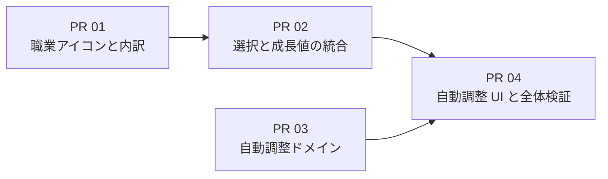

# Phase 2 操作性改善計画

## この文書の位置づけ

この文書は Phase 2 の実装方針と PR 分割を定める。今回は計画のみを対象とし、画面変更、依存関係の追加、SVG の追加は行わない。実装は別セッションで、各 PR の受け入れ条件を確認しながら順番に進める。

## 目的と完了条件

Phase 1 で完成した育成経路の編集機能を保ちながら、職業を選ぶときと育成経路全体を確認するときの負担を減らす。

次を満たした時点で Phase 2 を完了とする。

1. 育成計画画面で、並べ替えた職業の成長値を確認した場所から、その職業を追加または変更できる。
2. すべてのレベル帯について、選択済み職業の内訳をレベル帯を切り替えずに確認できる。
3. 未選択のレベルを HP、ST、物理攻撃、魔法攻撃、物理防御、魔法防御のいずれかへ特化して一括入力できる。
4. 自動調整の種類を選ぶと説明が表示され、利用者が対象と結果を理解してから実行できる。
5. 既存の手動編集、ドラッグ操作、共有 URL、チャート画面の挙動と互換性を維持する。
6. デスクトップ、狭い画面、マウス、タッチ相当、キーボード、ボタン操作のテストが通る。

## 対象外

- 選択済みのレベルを置換する自動調整
- 複数能力の重み付け、目標値、最終ステータスからの逆算
- 自動調整の取り消し履歴や複数案の比較
- 職業アイコンの最終デザイン
- 共有コード形式の変更
- 新しい UI 部品ライブラリや DnD ライブラリの導入

選択済み部分を含む自動調整は将来追加できる構造にするが、Phase 2 の画面には公開しない。

## 技術方針

### 職業選択と成長値の統合

統合を採用する。現在の職業カードは、カードを変更先としてドロップでき、その中に ×1、×10、×100 のドラッグ元を持っている。この構造を成長値の行へ移せるため、`@dnd-kit/react` の制約による阻害要因は現時点ではない。

育成計画画面では、現在の「職業の選択肢」と「職業ごとの成長値」を一つの職業一覧にする。各行に次を置く。

- 職業アイコンと職業名
- ×1、×10、×100 の追加操作
- 選択済み職業をその職業へ変更する操作
- 注目ステータスから計算したスコア
- HP、ST、物理攻撃、魔法攻撃、物理防御、魔法防御の成長値

一覧は現在と同じスコア順で並べ替える。追加ボタンとドラッグ元も行と一緒に移動するため、比較結果から別の一覧へ視線を戻さずに職業を選べる。

`PathEditor` が DnD の操作状態と育成経路を担当し、比較行の生成と注目ステータスの選択は独立した部品に分ける。チャート画面は編集操作を持たないため、共通の比較行データと表示部品を使いながら、ドラッグ元や追加ボタンは表示しない。

新しい DnD ライブラリやテーブルライブラリは追加しない。統合後もドラッグを使わず、クリックで選択して追加・変更できる手段を維持する。

### レベル帯ごとの職業内訳

`LevelRangeSelector` の各レベル帯ボタンに、職業アイコンと件数の組を表示する。例は「赤い fighter アイコン 2、黄色い strider アイコン 3」に相当する表示とする。既存の選択数と上限も残す。

職業ごとに単色の円を描く個別 SVG を `src/assets/vocations/` に置き、表示側は共通の `VocationIcon` から参照する。大きさは本文の文字と同程度の `1em` を基本とし、色や SVG は後から差し替えられるよう、職業 ID とファイルの対応を一か所に集約する。

初期色は識別しやすい仮色を割り当てる。色だけを情報源にせず、アイコンと件数の組には `fighter 2件` のような読み上げ名を付ける。未選択のレベル帯では内訳を表示せず、現在の `0/上限` 表示を維持する。

内訳の計算は JSX 内へ重複して書かず、`VocationPath` から職業別件数を返す純粋関数またはメモ化したセレクターへ集約する。育成経路の順序と共有コードは変更しない。

### 自動調整のモデル

自動調整は React と Redux に依存しないドメイン処理にする。処理を「どの職業を選ぶか」と「どのレベルを変更対象にするか」に分ける。

- **戦略:** 指定したステータスの値が最大になる職業を、レベル帯ごとの選択可能職業から選ぶ。
- **対象範囲:** Phase 2 では各レベル帯の未選択枠だけを対象にする。
- **適用:** すべてのレベル帯を走査し、既存の選択を保ったまま空き枠へ選んだ職業を追加する。

同値の職業が複数ある場合は、`availableVocationIds` の定義順で先にある職業を選び、結果を常に同じにする。満杯の経路では変更を行わない。レベル帯の職業制限と上限は既存のドメイン定義を使い、UI 側で別の判定を持たない。

API は入力経路に加え、次の戦略と対象範囲を受け取る形にする。

```ts
type PathAdjustmentRequest = {
  strategy: { kind: "maximize-stat"; statId: StatId };
  scope: { kind: "unfilled" };
};
```

戦略と対象範囲を別の型にすることで、将来 `scope` に全レベルや指定レベル帯を追加しても、能力特化の選択処理を作り直さずに済む。結果は新しい `VocationPath` と変更件数を返し、Redux は一つの action で経路全体へ反映する。既存の共有コードは最終的な育成経路だけを保存するため、形式変更は不要である。

### 自動調整の UI

体格 UI の上に「自動調整」セクションを置く。操作はネイティブの `select`、説明文、実行ボタンで構成する。

選択肢は次の 6 種類とする。

1. HP 特化で未選択レベルを埋める
2. ST 特化で未選択レベルを埋める
3. 物理攻撃特化で未選択レベルを埋める
4. 魔法攻撃特化で未選択レベルを埋める
5. 物理防御特化で未選択レベルを埋める
6. 魔法防御特化で未選択レベルを埋める

選択変更時に、対象が未選択レベルだけであること、既存の選択は変えないこと、どの能力を優先するかを説明文へ表示する。説明文は `select` から `aria-describedby` で参照する。ネイティブ `option` 内の説明表示はブラウザー差が大きいため、Phase 2 では独自コンボボックスを作らず、選択欄の直下に説明を出す。

実行ボタンは空き枠がない場合に無効化し、変更対象件数をボタン付近へ表示する。実行後は追加件数と選択した調整名をステータスメッセージで通知する。処理は全レベル帯を一度に更新し、途中状態を描画しない。

## コンポーネントと責務の案

| 領域                                                      | 責務                                                         |
| --------------------------------------------------------- | ------------------------------------------------------------ |
| `domain/pathEditing` または新しい `domain/pathAdjustment` | 職業別件数、空き枠、調整戦略、対象範囲、経路の一括生成       |
| `VocationIcon`                                            | 職業 ID と SVG の対応、共通サイズ、代替テキストの扱い        |
| `LevelRangeSelector`                                      | レベル帯の選択、使用数と上限、職業別内訳の表示               |
| 比較行の生成処理                                          | レベル帯、注目ステータス、職業成長値から安定した表示行を作る |
| 育成計画用の職業一覧                                      | 比較値、追加用ドラッグ元、変更先、ボタンによる代替操作       |
| チャート用の比較表示                                      | 共通の比較行を読み取り専用で表示                             |
| `AdjustmentControls`                                      | 調整の選択、説明、実行、結果通知                             |
| `editorSlice`                                             | ドメイン処理の結果を一度に状態へ反映                         |

ファイル名は実装時に既存構造との重複を確認して確定する。表示部品から計算処理を呼び分ける構造や、同じ比較行を画面ごとに再計算する構造は避ける。

## PR 分割

各 PR は前の PR がマージされた状態から作成する。振る舞いを変更する PR には単体テストとブラウザーテストを含め、README は利用可能になった機能と同じ PR で更新する。

### Phase 2 PR 01: 職業アイコンとレベル帯内訳

**範囲:** 9 職業分の仮 SVG、`VocationIcon`、職業別件数の計算を追加する。`LevelRangeSelector` に各レベル帯の職業内訳を表示し、デスクトップと狭い画面の折り返しを整える。

**レビューで確認:**

- レベル帯を切り替えなくても、4 レベル帯すべての職業と件数が分かる。
- 同じ職業が複数回現れても一つのアイコンと合計件数になる。
- 空のレベル帯、満杯のレベル帯、9 職業が混在する場合にレイアウトが壊れない。
- アイコンは `1em` 前後で表示され、SVG ファイルを差し替えて色や形を調整できる。
- スクリーンリーダーでは職業名と件数が分かり、色だけに依存しない。
- 育成経路、レベル帯の選択、共有コードの内容は変化しない。

### Phase 2 PR 02: 職業選択と成長値一覧の統合

**範囲:** 育成計画画面の職業選択肢と成長値一覧を統合する。比較行の生成、注目ステータス選択、読み取り専用表示、編集可能表示の責務を分ける。統合した行から ×1、×10、×100 の追加、配置済み職業の変更、クリックによる代替操作を行えるようにする。チャート画面は共通の比較データを使い、現在の読み取り専用表示を維持する。

**レビューで確認:**

- 注目ステータスによる並べ替え後、その行から直接職業を追加できる。
- 並べ替え後もドラッグ元の職業と数量を取り違えない。
- 配置済み職業を統合一覧の職業へドロップまたはボタン操作で変更できる。
- レベル帯の職業制限と上限を守り、無効な操作は状態を変更しない。
- マウス、タッチ相当、キーボード、クリックの各操作が通る。
- 横幅が狭い場合も職業名と操作ボタンを見失わず、成長値を閲覧できる。
- チャート画面の棒グラフ、表、並べ替え結果に回帰がない。

### Phase 2 PR 03: 自動調整のドメイン処理

**範囲:** 調整戦略と対象範囲の型、6 能力の最大化戦略、未選択枠への一括適用、変更件数を返す純粋関数を追加する。Redux や画面にはまだ接続しない。

**レビューで確認:**

- 各レベル帯で選択可能な職業だけを使う。
- 既存の選択と順序を保持し、空き枠だけを上限まで埋める。
- 6 能力について代表的なレベル帯の期待職業と一致する。
- 同値の場合の職業が定義順で安定する。
- 空の経路、途中まで入力した経路、満杯の経路を処理できる。
- 入力の `VocationPath` を変更せず、新しい経路と正しい変更件数を返す。
- 対象範囲を追加できる境界があり、能力戦略が未選択枠の実装へ依存しない。

### Phase 2 PR 04: 自動調整 UI と全体検証

**範囲:** `AdjustmentControls` と Redux の一括更新 action を追加する。6 種類の選択肢、選択内容の説明、変更対象件数、実行、結果通知を実装する。README を更新し、Phase 2 の一連のブラウザーテストを完成させる。

**レビューで確認:**

- 選択を変更すると、実行前に対応する説明を確認できる。
- 実行 1 回で未選択枠が選んだ能力へ特化した職業で埋まる。
- 既存の選択は変更されず、満杯の場合は実行できない。
- 実行後に現在のステータス、レベル帯内訳、統合一覧、チャートが同じ経路を表示する。
- 自動調整後の共有 URL を開くと同じ育成経路と体格を復元できる。
- キーボードだけで選択、説明の確認、実行ができ、フォーカス表示と結果通知が分かる。
- デスクトップと幅 390px 相当で主要操作を完了できる。
- `npm run check` と本番プレビューに対する `npm run test:e2e` が通る。

## 実装順と依存関係



PR 03 は機能上 PR 01、PR 02 から独立している。ただしレビューと競合解消を単純にするため、基本は PR 01、PR 02、PR 03、PR 04 の順で進める。

## テスト方針

### 単体テスト

- 職業別件数の集計
- 比較行のスコアと安定した並べ替え
- 6 能力の自動調整結果
- レベル帯ごとの職業制限、上限、同値時の順序
- 入力を変更しないことと変更件数
- Redux の一括適用

### コンポーネントテスト

- レベル帯内訳の表示と読み上げ名
- 統合一覧の追加・変更用コールバック
- 注目ステータス変更後の順序と操作対象
- 自動調整の選択肢、説明、無効状態、結果通知

### ブラウザーテスト

- 統合一覧でのマウス、タッチ相当、キーボードの追加と変更
- ボタンだけを使った同じ育成経路の作成
- 4 レベル帯の内訳が編集直後に更新されること
- 自動調整からステータス確認、チャート移動、共有、復元までの一連の操作
- 幅 390px 相当での一覧閲覧、レベル帯選択、自動調整
- 既存の共有 URL サンプルと不正コード処理の回帰確認

## 実装開始時の確認事項

- Phase 2 の各ブランチは最新の `main` から作成する。
- 実装開始前に固定済み依存関係の更新有無を確認するが、要件に不要な一括更新は同じ PR に含めない。
- SVG の色は仮値として扱い、職業 ID とファイル名を固定して後からアセットだけ差し替えられるようにする。
- 統合一覧の変更では、視覚的な並び順だけでなく DnD の ID、読み上げ、フォーカス移動先が同じ職業を指すことをテストする。
- 自動調整は実行時点の Redux 状態を入力にし、UI が保持した古い経路へ適用しない。
- 将来の「選択済み部分も含めた調整」は別 PR で対象範囲、確認方法、取り消し手段を設計してから公開する。
